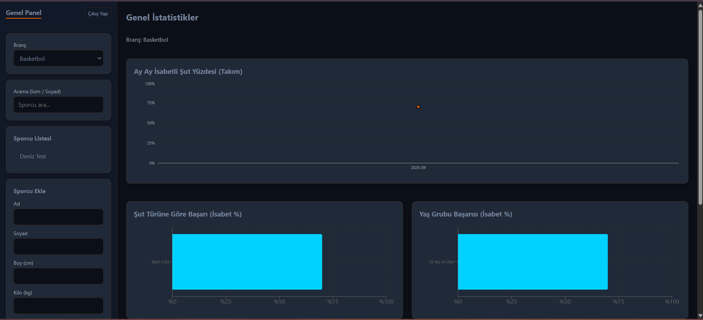
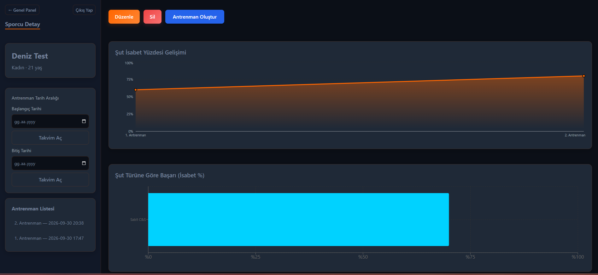
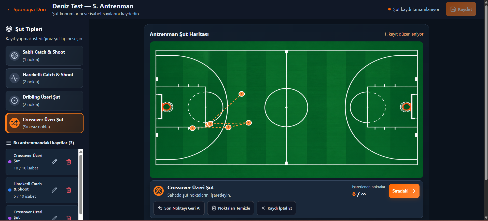

# Sporcu ve Antrenman Şut Takip Sistemi

Antrenörlerin sporcu bilgilerini, antrenmanlarını ve şut performansını takip edebildiği bir üniversite bitirme projesidir. Sporcular Basketbol ve Voleybol branşlarına göre listelenir; şut kaydı ekranında basketbol şut türleri ve saha haritası kullanılır.

Bu depoda çalışan web uygulaması, Node.js API sunucusu ve geliştirme aşamasındaki mobil uygulama bulunur. Web tarafındaki temel kullanım akışları yerel ortamda kontrol edilmiştir. Mobil uygulamanın fiziksel cihaz testi henüz yapılmamıştır.

## Özellikler

- Antrenör hesabı oluşturma, giriş yapma ve çıkış yapma.
- Hesaba bağlı sporcu ve antrenman kayıtları.
- Branşa göre sporcu listeleme ve isme göre arama.
- Sporcu ekleme ve düzenleme: ad, soyad, boy, kilo, yağ oranı, doğum tarihi ve cinsiyet.
- Doğum tarihini takvimden seçme ve yaşın otomatik hesaplanması.
- Sporcu detayları, antrenman oluşturma ve şut kayıtlarını ayrı ayrı düzenleme veya silme.
- Kaydedilmemiş değişikliklerle sayfadan ayrılırken uyarı; kaydı iptal ederek son kaydedilen verileri koruma.
- Saha üzerinde şut noktalarını işaretleme; şut türü, deneme ve isabet sayısı kaydetme.
- Başlangıç ve bitiş tarihlerini takvimden seçerek antrenman listesini, gelişim grafiğini ve şut türü grafiğini birlikte filtreleme.
- Antrenman saatlerini ve tarih filtrelerini Türkiye saatine göre gösterme.
- Şut denemesi olmayan antrenmanları listede tutup gelişim grafiğinden çıkarma; gerçek %0 isabet sonuçlarını grafikte koruma.
- Sporcu gelişimi, aylık performans, şut türü ve yaş grubu başarı grafikleri.
- SQLite ile kayıtların uygulama kapatıldıktan sonra da saklanması.
- Küçük ekranlara uyarlanan web menüleri, formlar ve antrenman düğmeleri.
- Panel, sporcu ve antrenman sayfalarını ihtiyaç olduğunda yükleme.

## Ekran görüntüleri

Görseller yerel uygulamada örnek sporcu ve antrenman kayıtlarıyla alınmıştır.

### Genel panel

Branşa göre sporcu listesi ve performans grafikleri.



### Sporcu detayı

Sporcu bilgileri, takvimle tarih filtreleme ve antrenman gelişimi.



### Şut haritası

Şut türü seçimi, saha üzerinde nokta işaretleme ve antrenman kayıtları.



### Karşılama ekranı

Antrenör girişi ve yeni hesap oluşturma seçenekleri.


## Teknolojiler

| Katman | Teknolojiler |
| --- | --- |
| Web | React, Vite, React Router, Recharts, Lucide |
| Sunucu | Node.js, Express |
| Veritabanı | SQLite, better-sqlite3 |
| Mobil | React Native, Expo, Expo Router |
| Testler | Node.js test runner |

## Ekip çalışması ve katkılar

Proje ekip çalışması olarak geliştirilmiştir. Bu depo, **Ayşe Gül Alnar’ın üzerinde çalıştığı sürümü** içerir.

- **Ayşe Gül Alnar:** Frontend arayüzleri, tasarım, analiz ve veri görselleştirme ekranları, API entegrasyonu ve bu sürümün son düzenlemeleri.
- **Efe Telimen:** Projenin başlangıcındaki backend ve veritabanı çalışmaları; proje raporlarında bu alanların görev sorumluluğu.

Bu açıklama ekipteki görev dağılımını belirtir; depodaki bütün kodun tek kişi tarafından yazıldığı anlamına gelmez. İlk proje sonrasında oturum ve veri doğrulama kontrolleri, tarih seçimi ve kişisel bilgi alanları, sunucu modülleri, şut kaydı düzenleme/silme, analiz filtreleri, küçük ekran düzenlemeleri, sayfa yükleme ve yayın hazırlığı AI desteğiyle geliştirilmiştir.

## Yerel kurulum

Bu sürüm Windows üzerinde **Node.js 24** ile çalıştırılıp kontrol edilmiştir. Node.js, npm ve Git kurulu olmalıdır.

Depoyu indirdikten sonra proje ana klasöründe bir terminal açın. Önce bağımlılıkları yükleyin:

```sh
npm install
npm run install:all
```

Ardından web uygulamasını ve API sunucusunu birlikte başlatın:

```sh
npm run dev
```

Tarayıcıda **http://localhost:5173** adresini açın. API sunucusu varsayılan olarak **http://127.0.0.1:3001** adresinde çalışır. Uygulamayı kullanırken terminal açık kalmalıdır; durdurmak için `Ctrl+C` kullanın.

İlk kullanımda yeni bir antrenör hesabı oluşturup giriş yapın. Şifre 10–128 karakter olmalıdır. Depoda hazır hesap veya kişisel sporcu verisi bulunmaz.

Veritabanı ilk çalıştırmada `server/sport.db` dosyasında otomatik oluşturulur. Bu dosya Git takibinin dışındadır. Yerel kayıtların korunması için dosyayı saklayın.

## Proje yapısı

| Klasör | İçerik |
| --- | --- |
| `client/` | React web arayüzü |
| `server/` | Express API, SQLite erişimi ve sunucu testleri |
| `mobile/` | Geliştirme aşamasındaki Expo mobil uygulaması |
| `shared/` | Web ve sunucunun ortak Türkiye saati yardımcıları |
| `docs/` | Ekran görüntüleri, geliştirme ve doğrulama notları |

## Kontroller ve mevcut durum

Tüm komutları proje ana klasöründeki aynı terminalden çalıştırın:

```sh
npm test --prefix server
node --test client/tests/*.test.js
npm run build --prefix client
```

2 Ekim 2026 doğrulamasında **20 sunucu testi ve 6 web yardımcı işlev testi geçti**; web üretim derlemesi tamamlandı. Sunucu testleri geçici veritabanları kullanır; mevcut sporcu kayıtlarını değiştirmez. Bu testler tarayıcı arayüz testleri değildir.

Yerel tarayıcı kontrollerinde sporcu ekleme/düzenleme, otomatik yaş, cinsiyet, takvimle filtreleme, şut kaydı düzenleme/silme, kaydedilmemiş değişiklik uyarısı, iptal sonrası kayıtların korunması ve antrenman adresinde sayfa yenileme kontrol edildi. Çıkış ve yeniden giriş sonrası kayıtlar korundu; çıkıştan sonra geri düğmesiyle korumalı panele erişilemedi.

Chrome'un 390 × 608 ekran benzetiminde menüler, sporcu düzenleme formu ve antrenman düğmeleri kontrol edildi. Bu kontrol gerçek telefon veya tüm ekran boyutlarının testi değildir. Mobil uygulamanın fiziksel cihaz testi ve üretim ortamına dağıtım henüz doğrulanmamıştır.

Sayfaların ihtiyaç olduğunda yüklenmesiyle başlangıç JavaScript dosyası 680,45 kB’den 251,47 kB’ye (gzip: 199,90 kB’den 82,81 kB’ye) düştü; 500 kB paket uyarısı kalktı. Bu ölçüm gerçek ağda açılış süresi ölçümü değildir. Ayrıntılar [sayfa yükleme notlarında](docs/sayfa-yukleme.md).

## Oturum ve veri kontrolleri

- Parolalar rastgele tuzla scrypt kullanılarak hashlenir.
- Web oturumu HttpOnly ve SameSite=Strict çereziyle tutulur; oturum süresi 8 saattir. Çıkış sunucudaki oturumu iptal eder.
- Sporcu, antrenman ve grafik sorguları antrenör hesabına göre sınırlandırılır.
- Sporcu bilgileri ve şut kayıtları sunucuda doğrulanır. İsabet sayısı deneme sayısını aşamaz; doğum tarihi gelecekte olamaz.
- Şut kayıtları tek veritabanı işlemi içinde güncellenir; yazma hatasında önceki kayıtlar korunur.
- Yaş grubu, antrenman tarihindeki yaşa göre hesaplanır. Doğum tarihi olmayan sporcular ayrı değerlendirilir.

Bu sürüm yerel geliştirme ve portföy gösterimi içindir. İnternete açık kullanım için HTTPS, dağıtım yapılandırması ve üretim ortamı kontrolleri ayrıca tamamlanmalıdır. Sunucuda `NODE_ENV=production` kullanıldığında oturum çerezleri Secure olur ve HTTPS gerekir. `ALLOWED_ORIGINS` izin verilen web adreslerini belirler.

## Mobil uygulama

Mobil uygulama aynı API sunucusunu kullanır; web arayüzünden farklı bir görünüme sahiptir. JS/JSX dosyaları sözdizimi açısından kontrol edilmiştir, ancak fiziksel cihazda çalışması henüz doğrulanmamıştır.

Mobil kurulum ve API adresi ayarları için [mobil uygulama açıklamasına](mobile/README.md) bakın. API sunucusu varsayılan olarak yalnızca kendi bilgisayarından erişilebildiğinden, telefon testi için ağ adresi ve sunucu ayarları da gerekir.

## Sonraki geliştirmeler

- Web görünümünün farklı telefon ve tablet boyutlarında ve gerçek cihazlarda kontrol edilmesi.
- Klavye erişimi, okunabilirlik ve hata mesajlarının iyileştirilmesi.
- Mobil uygulamanın cihazda test edilmesi ve web özellikleriyle karşılaştırılması.
- Yeni özellikleri gösteren ekran görüntülerinin güncellenmesi.
- Üretim ortamı kurulumu ve dağıtımının doğrulanması.

## Geliştirme planı ve kaynak incelemesi

İlk proje kopyasıyla güncel sürümün karşılaştırılması ve geliştirme sırası [inceleme notlarında](docs/gelistirme-plani.md) açıklanmıştır.

Uygulanan değişikliklerin ayrıntıları:

- [Sunucu yapısı](docs/sunucu-yapisi.md)
- [Şut kayıtları ve kaydedilmemiş değişiklikler](docs/antrenman-kayitlari.md)
- [Analiz tarih filtresi](docs/analiz-tarih-filtresi.md)
- [Sayfaların ihtiyaç olduğunda yüklenmesi](docs/sayfa-yukleme.md)
